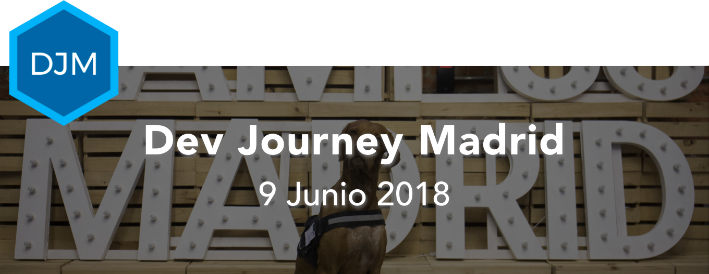

# Dev Journey Madrid - Event Template 
Used for the Dev Journey Madrid 2018 event - https://devjourneymad18.netlify.com/

#### Info
> 📅 __Sábado 9 Junio 2018__  
> 📌 __Campus Madrid__, Calle Moreno Nieto, 2, 28005 Madrid   
> 📍 __Maps__: https://goo.gl/maps/unGB5Rk1o8m

#### Agenda 

| Hora          | Sala - Auditorio Principal                |
| ------------- | --------------------------------------    |
| 10:00 - 10:20 | Entrada y Desayuno                        |
| 10:20 - 10:30 | Bienvenida                                |
| 10:30 - 11:15 | Isabelle Mauny - La protección de APIs no es tan difícil...  |
| 11:15 - 12:00 | Kike Garcia Navalon - Firestore en 45 min |
| 12:00 - 12:45 | Juan Garza - Stackoverflow en Español     |
| 12:45 - 13:30 | Networking & Beers -                      |

